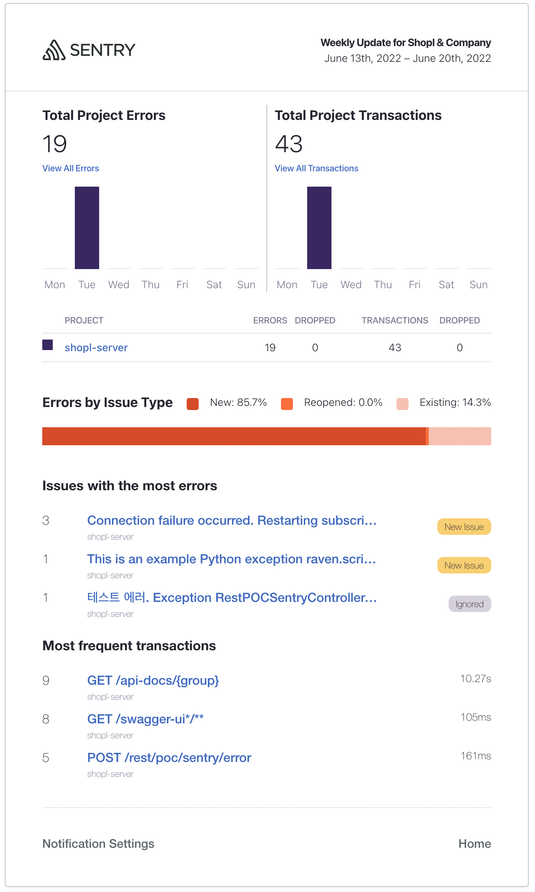

[comment]: # (This presentation was made with markdown-slides)
[comment]: # (This is a CommonMark compliant comment. It will not be included in the presentation.)
[comment]: # (Compile this presentation with the command below)
[comment]: # (mdslides sentry.md --include sentry-resource)

[comment]: # (Set the theme:)
[comment]: # (THEME = white)
[comment]: # (CODE_THEME = base16/zenburn)
[comment]: # (The list of themes is at https://revealjs.com/themes/)
[comment]: # (The list of code themes is at https://highlightjs.org/)

[comment]: # "You can also use quotes instead of parenthesis"
[comment]: # "THEME = white"

[comment]: # (Pass optional settings to reveal.js:)
[comment]: # (controls: true)
[comment]: # (keyboard: true)
[comment]: # (markdown: { smartypants: true })
[comment]: # (hash: false)
[comment]: # (respondToHashChanges: false)
[comment]: # (Other settings are documented at https://revealjs.com/config/)

Harry | Shopl&Company

# Sentry 소개

[comment]: # (!!! data-background-video="sentry-resource/video.mp4", data-background-video-loop data-background-video-muted data-background-opacity="0.2")

### 완벽한 앱은 없다

오류는 항상 존재한다.
😱

[comment]: # (|||)

### 컴플레인 전 문제상황을 보고 받는다면

1. 담당자에게 슬랙으로 에러 발생 알림 
2. 링크 클릭 시 실시간으로 발생한 에러 정보 확인
3. 사용자 정보, 에러발생 지점, 파라미터 등

[comment]: # (|||)

### 효과

- 문제파악에 시간 절약 
- CS 대응 시 정확한 정보 확인 가능
- CS -> 개발자 커뮤니케이션 줄어듬
- 빠른 오류 대응
- 고객 컴플레인 대응시간 줄어듬
- 오류를 겪는 사용자 수 줄어듬
[comment]: # (!!!)

### [Sentry](https://sentry.io)
- 실시간으로 에러상황을 모니터링하고 
- 수정할 수 있도록 도와주는 
- 오픈 소스 **오류 추적 플랫폼** 
- 물리적 서버, 가상 서버 등 각종 앱 모니터링 가능

[comment]: # (!!!)

### 정확한 에러 발생 지점 표시


[comment]: # (!!!)

### 에러 발생까지의 순차적 이벤트 추적


[comment]: # (!!!)
### Frontend 앱의 예시


[comment]: # (!!!)
### Android 앱의 예시


[comment]: # (!!!)
### 성능 측정


[comment]: # (!!!)

### Sentry 프로젝트 생성 1/3


[comment]: # (!!!)

### Sentry 프로젝트 생성 2/3


[comment]: # (!!!)

### Sentry 프로젝트 생성 3/3


[comment]: # (!!!)

### 실제 shopl-server 연동 1/2

Spring Boot Application / **pom.xml**

```xml [1-8|9-16]
<dependencies>
    ...
    <!-- Sentry 연동 라이브러리 -->
    <dependency>
        <groupId>io.sentry</groupId>
        <artifactId>sentry-spring-boot-starter</artifactId>
        <version>6.0.0</version>
    </dependency>
    <!-- log.error 결과를 남기기 위한 로그백 통합 라이브러리 -->
    <dependency>
        <groupId>io.sentry</groupId>
        <artifactId>sentry-logback</artifactId>
        <version>6.0.0</version>
    </dependency>
    ...
</dependencies>
```

[comment]: # (!!!)

### 실제 shopl-server 연동 2/2

Spring Boot Application / **application.properties**

```properties [1|2]
sentry.dsn=https://23205fcd291747bdb356ef63a78cb248@o1287717.ingest.sentry.io/6503286
sentry.traces-sample-rate=1.0
```

*dsn*: Data Source Name

[comment]: # (!!!)

### 작동 테스트를 위한 예시 코드 작성

```java
  @SentrySpan
  @PostMapping(value = "/error")
  @Operation(summary = "강제 에러 발생")
  public String forceError(String name) throws Exception {
    if (Boolean.TRUE) {
      throw new Exception("테스트 에러.");
    }
    return "Hello " + name;
  }
```

[comment]: # (!!!)

### 에러 이슈 화면


[comment]: # (!!!)

### 알림 설정


- 슬랙
- 이메일
- SQS
- ...

[comment]: # (!!!)
### 주간 이메일 리포팅

 <!-- .element: style="height:500px;" -->

[데모](https://try.sentry-demo.com/organizations/sweeping-buffalo/issues/8893/?client=%7B%22acceptedTracking%22%3A%221%22%2C%22extraQueryString%22%3A%22%22%7D&project=4735#exception)

[comment]: # (!!!)

### Sentry SAAS 비용


- 개발자 플랜으로 사용 시 제약사항은 있지만 평생 무료 

[comment]: # (!!!)

### 팀 플랜 사용 시 추가기능


[comment]: # (|||)

- 이슈 처리 담당자 지정
- Jira 연동
  - 사전 조건을 기반으로 자동으로 Jira 티켓 생성 
  - 이슈 해결 상태 동기화
- 월 에러 트래킹 개수 5천개 -> 5만개
- Slack 등 외부연동 알림 가능
- Github 연동 가능
- ...

[기능 비교](https://sentry.io/pricing/)

[comment]: # (!!!)

## 🙂 감사합니다.

[comment]: # (!!!)

### 🥠 쿠키 슬라이드 

*직접 설치하여 사용하는 것도 가능합니다*

- [Self-Hosted Sentry](https://develop.sentry.dev/self-hosted/)

- SAAS 사용 비용이 부담스러운데 용량 제한 신경쓰지 않고 사용하고 싶다면 

[comment]: # (!!! data-background-color="aquamarine")

## 🙂 진짜 감사합니다.
