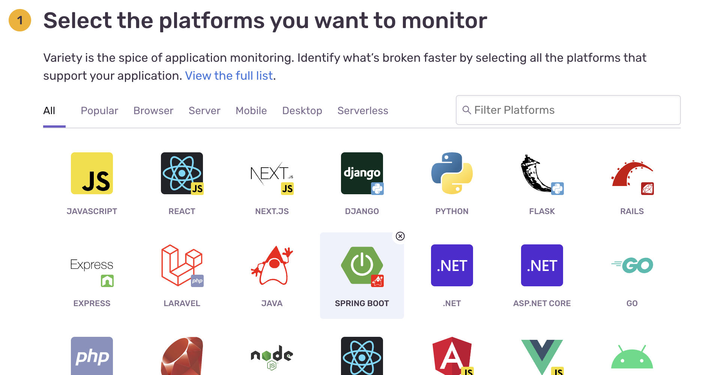
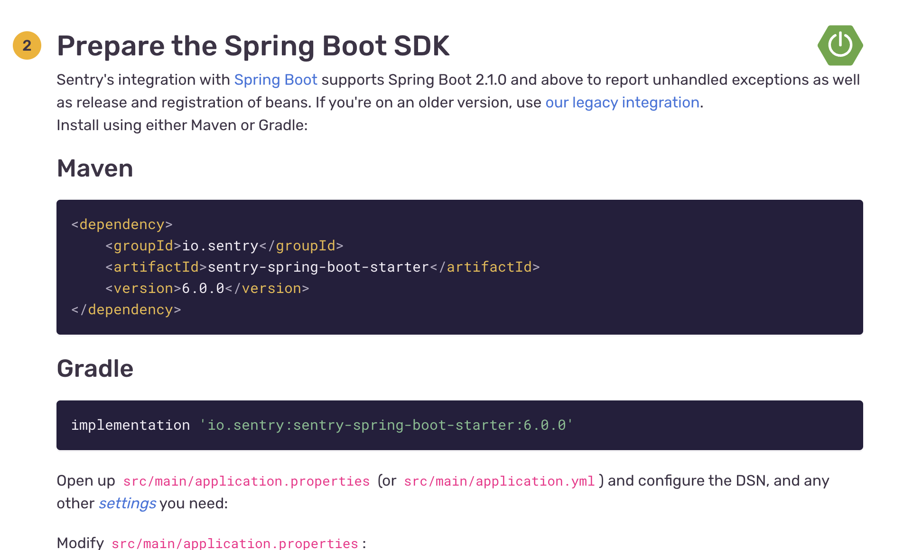
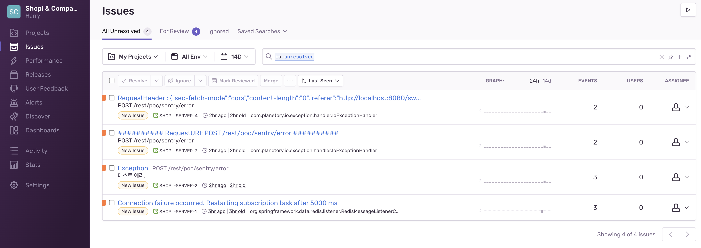
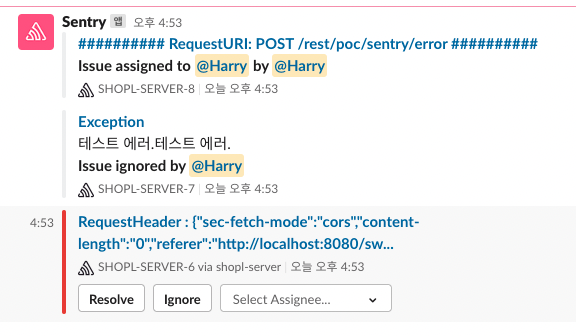
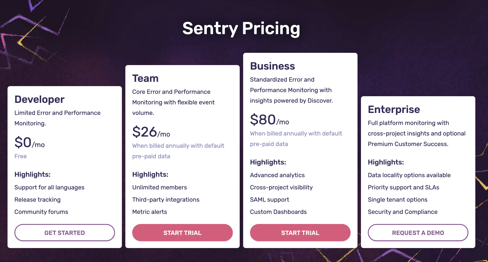

[comment]: # (This presentation was made with markdown-slides)
[comment]: # (This is a CommonMark compliant comment. It will not be included in the presentation.)
[comment]: # (Compile this presentation with the command below)
[comment]: # (mdslides sentry.md --include sentry-resource)

[comment]: # (Set the theme:)
[comment]: # (THEME = white)
[comment]: # (CODE_THEME = base16/zenburn)
[comment]: # (The list of themes is at https://revealjs.com/themes/)
[comment]: # (The list of code themes is at https://highlightjs.org/)

[comment]: # "You can also use quotes instead of parenthesis"
[comment]: # "THEME = white"

[comment]: # (Pass optional settings to reveal.js:)
[comment]: # (controls: true)
[comment]: # (keyboard: true)
[comment]: # (markdown: { smartypants: true })
[comment]: # (hash: false)
[comment]: # (respondToHashChanges: false)
[comment]: # (Other settings are documented at https://revealjs.com/config/)

Harry | Shopl&Company | 2022-06-14

# Sentry 소개

[comment]: # (A comment starting with three or more !!! marks a slide break.)
[comment]: # (!!!)

[Sentry](https://sentry.io)는 개발자가 실시간으로 충돌을 모니터링하고 수정할 수 있도록 도와주는 오픈 소스 **오류 추적 플랫폼** 
물리적 서버, 가상 서버, 라이브러리 및 각종 애플리케이션의 모니터링 가능

[comment]: # (!!!)

### 정확한 에러 발생 지점 표시


[데모](https://try.sentry-demo.com/organizations/sweeping-buffalo/issues/8893/?client=%7B%22acceptedTracking%22%3A%221%22%2C%22extraQueryString%22%3A%22%22%7D&project=4735#exception)

[comment]: # (!!!)

### 에러 발생까지의 순차적 이벤트 추적


[comment]: # (!!!)

### 성능 측정


[데모](https://try.sentry-demo.com/organizations/sweeping-buffalo/performance/summary/?project=4735&statsPeriod=7d&transaction=%2Fproductstore&client=%7B%22acceptedTracking%22%3A%221%22%2C%22extraQueryString%22%3A%22%22%7D)

[comment]: # (!!!)

### Sentry 프로젝트 생성 1/3



[comment]: # (!!!)

### Sentry 프로젝트 생성 2/3


[comment]: # (!!!)

### Sentry 프로젝트 생성 3/3



[comment]: # (!!!)

### 실제 shopl-server 연동 1/2

Spring Boot Application / **pom.xml**

```xml [1-2|3-7|8-14]
<dependencies>
    ...
    <dependency>
        <groupId>io.sentry</groupId>
        <artifactId>sentry-spring-boot-starter</artifactId>
        <version>6.0.0</version>
    </dependency>
    <dependency>
        <groupId>io.sentry</groupId>
        <artifactId>sentry-logback</artifactId>
        <version>6.0.0</version>
    </dependency>
    ...
</dependencies>
```

[comment]: # (!!!)

### 실제 shopl-server 연동 2/2

Spring Boot Application / **application.properties**

```properties [1|2]
sentry.dsn=https://23205fcd291747bdb356ef63a78cb248@o1287717.ingest.sentry.io/6503286
sentry.traces-sample-rate=1.0
```

*dsn*: Data Source Name

[comment]: # (!!!)

### 작동 테스트를 위한 예시 코드 작성

```java [2-9|1]
  @SentrySpan
  @PostMapping(value = "/error")
  @Operation(summary = "강제 에러 발생")
  public String forceError(String name) throws Exception {
    if (Boolean.TRUE) {
      throw new Exception("테스트 에러.");
    }
    return "Hello " + name;
  }
```

[comment]: # (!!!)

### 에러 이슈 화면



[comment]: # (!!!)

### 알림 설정



- 슬랙
- 이메일
- SQS
- ...

[comment]: # (!!!)

### 비용



[comment]: # (!!!)

## 🙂 감사합니다.